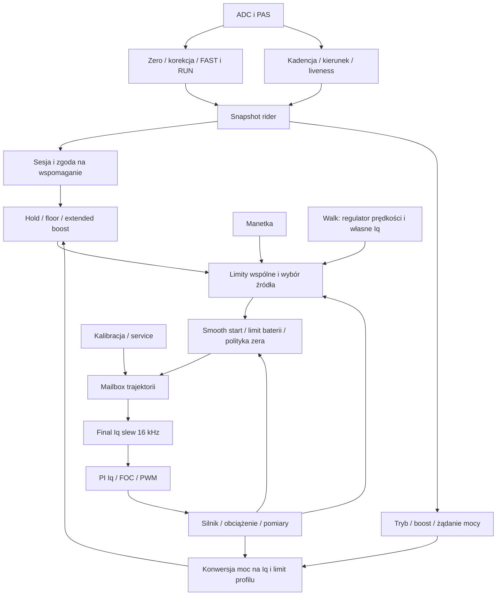

# eVistDrive — globalny plan uporządkowania toru wspomagania

Stan: 2026-09-08. **Etap 1: audyt i propozycja architektury — READY_FOR_REVIEW. Naprawa zachowania: jeszcze niewdrożona.**

Źródło wymagań: master plan przekazany przez właściciela w sesji oraz polecenie globalnego przeglądu po wielokrotnych lokalnych poprawkach. Priorytety: płynna pomoc między naciśnięciami pedałów, prawidłowe odpuszczenie i start, rzeczywiste działanie konfiguracji CANable. TSDZ2 jest odniesieniem dla funkcji i ich znaczenia, a nie wzorem kodu do przeniesienia.

Ten dokument jest punktem kontynuacji pracy. Kod bieżącego drzewa ma pierwszeństwo przed historycznymi opisami FW. Numery linii są wskazówkami dla badanego drzewa, nazwy funkcji są trwalszymi kotwicami. Audyt objął firmware, CANable, generator Controller Lab oraz dostępny kod referencyjny TSDZ2. Nie zmieniono algorytmu produkcyjnego ani konfiguracji roweru.

## CURRENT STATE

### 1. Wniosek globalny

Problem nie sprowadza się do jednej zbyt krótkiej rampy. W torze występują osobne pamięci i reguły czasu: FAST/RUN, filtr kadencji, sesja, bramka pedałowania, startup boost, smooth start, hold/floor, extended boost, limity z histerezą i końcowa trajektoria Iq. Część ma uzasadnione, różne zadania; część nadpisuje wynik poprzedniego mechanizmu albo zmienia znaczenie konfiguracji.

**Najmocniej potwierdzone:**

1. W zwykłym RUN wynik okna kątowego jest nadpisywany przez filtr czasowy. Okna 30°, 180° i 360° dały identyczny cały przebieg. Wartość 0 przełącza na FAST, a nie na surowy moment.
2. Końcowy ogranicznik nachylenia przy domyślnych nastawach praktycznie śledzi już pofalowane żądanie. Nie jest regulatorem średniej pomocy podczas obrotu korby.
3. `assist_min_iq_pct` nakłada podłogę po ograniczeniu Iq w trybie i liczy ją od limitu globalnego ride core. Może przekroczyć limit profilu: w próbie limit trybu 7 counts, podłoga domyślna 14; przy podłodze 25% wynik 175. Nie oznacza to przekroczenia globalnego sprzętowego maksimum 700 w tej próbie, lecz złamanie limitu obiecanego przez profil.
4. `assist_without_rotation` może wyprodukować żądanie w trybie, które następnie blokuje wspólna bramka wymagająca kierunku/ruchu PAS.
5. `assist_run_deadband_mv` nie steruje aktywnym wyliczaniem wspomagania; `startup_boost_end_rpm` nie wyznacza końca boostu w trybie CADENCE. Pola filtrów mocy są obecnie nieaktywne i UI już je tak oznacza.
6. Generator korzysta z produkcyjnych modułów C, ale wymusza m.in. `u_abs=0` i prąd baterii 0. Pokazuje prawdziwe problemy kompozycji żądania, lecz nie odtwarza pełnej pracy napędu z obciążeniem i sprzężeniem zwrotnym.

### 2. Granice dowodów

Oznaczenia: **CODE** — potwierdzone aktywnymi wywołaniami i konsumentami; **HOST** — powtarzalna próba produkcyjnych modułów; **INFERENCE** — interpretacja wymagająca dalszego pomiaru; **HW OPEN** — bez rozstrzygnięcia na rowerze.

Punktem odniesienia jest lokalne drzewo firmware na HEAD `9b41070` oraz CANable na HEAD `9de23be`, z zastanym WIP. Same te commity nie identyfikują całego badanego kodu. Manifest plików i wyniki: [assist-pipeline-evidence](assist-pipeline-evidence/README.md). Nie utożsamiamy kontrolowanego presetu z ustawieniami użytymi do zrzutu ekranu użytkownika.

Zrzut pokazuje Iq reference w counts; nie jest pomiarem mocy mechanicznej ani odczucia rowerzysty. To, że takie falowanie może być odczuwalne, jest uzasadnioną hipotezą. Jego wielkość na prawdziwym rowerze zależy też od regulatora prądu, napędu, przełożenia i bezwładności.

### 3. Mapa całego toru

Diagram upraszcza odgałęzienia: Walk ma własną ścieżkę limitów i końcowe BYPASS, service osobny priorytet. Sprzężenie `u_abs`, prądu baterii i prędkości oznacza, że rzeczywisty tor nie jest tylko jednokierunkowym łańcuchem filtrów.

| Etap / właściciel | Wejście → wyjście / jednostki | Rytm i stan | Konfiguracja i konsumenci |
|---|---|---|---|
| ADC, `main.c` ok. 2684; `torque_input_correct` | ADC momentu → skorygowany native | Główna pętla nominalnie 4 kHz; offset, korekcja zera | Kalibracja czujnika; wejście `torque_input` i legacy telemetry |
| PAS, `pas_cadence.c`, `pas_liveness.c` | Zbocza → okres, kierunek, stop, kroki | Zdarzenia; 4 zbocza = 15°, timeout i epoki | Parametry PAS; kadencja, sesja, recovery, mostek |
| `cadence_filter.c` | Surowa kadencja → kadencja sterowania | IIR 1/8 przy ważnym zdarzeniu kadencji, nie co tick 4 kHz; seed i reset na stop | Tryby i adaptacja ramp; surowa wartość pozostaje osobną obserwacją |
| Legacy `main.c` ok. 2796 | Native → `MS.torque_filtered` | EMA co 3,75°; akumulator i liczniki | `MS.TQfilter` z Para0; głównie legacy `MS.p_human`/telemetria, ale liczniki uczestniczą w resetach |
| FAST, `torque_input_update_elapsed` | Delta po progu → FAST native | 35 ms, elapsed-time, nominalnie 4 kHz | Kalibracja i stały deadband native; start, recovery, pomoc bez obrotu w trybie |
| RUN kątowy, `torque_input_run_filter_step` | Próbki FAST → średnia pierścienia | Co 3,75°, bufor i suma; krok następuje przed aktualizacją bieżącego ticka | Okno stopni; zapisuje `run_value`, użycie koliduje z następnym wierszem |
| RUN czasowy, `update_run_asym_filter_one` | FAST → RUN native | Narastanie 120 ms, opadanie 250 ms; własny akumulator, elapsed-time | Dla zwykłego IDLE recovery i okna >0 nadpisuje wynik kątowy; tryby korzystają z tego RUN |
| RUN recovery, `torque_input.c` | Stop/restart/kroki → seed lub TRACK_FAST | Stany WAIT/TRACK_FAST/IDLE; reset/seed ring i filtra | `ride_control` steruje lifecycle; zmiana okna resetuje recovery |
| `rider_input.c`, `main.c` ok. 3042–3083 | RAW/FAST/RUN, kadencja, PAS, wheel → snapshot | Kopia danych 4 kHz; brak dodatkowej estymacji wysiłku | `ride_control`, `assist_modes`; wartości nie są synonimami jednej „siły” |
| `ride_session.c` | Load/PAS/stop/rolling/inhibit → COLD/ACTIVE/SUSPENDED | Sesja i progi start/restart | Per-level load, rolling load, kroki; wpływa na bramkę i recovery |
| `pedal_assist_gate.c` + `ride_control.c` | Load, kierunek, sesja → zezwolenie | Dodatkowy latch; zamykanie na stop/inhibit/utracie sesji | Współwłasność permission; końcowe wyzerowanie żądania |
| `assist_modes.c: prepare_mode_input` | RUN native → kalibrowana siła, moc człowieka | 4 kHz; zależnie od trybu cadence/start | Krzywa kalibracji, full scale, długość korby; wspólne wejście trybów |
| `assist_start.c: assist_start_apply_boost` | Siła → siła po boost | LUT kadencji oraz latch SPEED/AUTO | Enable/mode/strength/end rpm, global cadence step; przed nieliniowością trybu |
| Tryby `assist_modes.c` | Siła/kadencja → żądanie mocy i launch anchor | 4 kHz; konfiguracja banku i poziomu | 1 linear, 2 progressive, 3 eMTB, 5 torque, 6 curve; 4 odrzucany |
| `cadence_comp.c`, `finish_power_request` | Żądanie mocy → skompensowane W | LUT, poza start phase | Per-bank enable; jednorazowo dla obu anchorów |
| Konwersja `finish_power_request` | W, V, `u_abs` → prąd baterii / phase Iq counts | 4 kHz; mieszanie launch/run zależnie od utilization | Max W, max Iq %, voltage reference; wynik trybu |
| Hold/floor, `ride_control.c` ok. 650 | Mode Iq → podtrzymane minimum | Licznik odświeżany dodatnim żądaniem; odliczany przy zerze | Global hold i floor; po lokalnym limicie profilu |
| `assist_extended_boost.c` | Próg siły + zapamiętane Iq → boost Iq | Potwierdzenie obciążenia 30 ms, timer, snapshot ostatniego pedałowania | Trigger/strength/duration; przed limitem baterii i trajektorią; reaplikuje limit profilu |
| `assist_limits.c` | Iq źródła + V/temp/speed → ograniczone Iq | Mapy limitów, osobne klasy źródła | Voltage minimum, temp, legal/offroad, speed; throttle/pedal ograniczane oddzielnie |
| Arbitraż `ride_control.c` | Pedal i throttle → max żądań | 4 kHz; priorytety Walk/service/safety | Manetka nie jest sumowana z pedałami ani automatycznie limitem profilu |
| Smooth start, `assist_start_apply_smooth` | Iq po arbitrażu → skalowane Iq | Osobna obwiednia elapsed/duration liczona wywołaniami 4 kHz | Enable/ms per-level; wykrycie startu z postoju; następnie nadal final slew |
| `battery_iq_cap.c` | Prąd baterii, duty, Iq → allowed Iq | Latch 4 kHz, powrót przy 90% progu | Battery max i phase max; przed final slew, więc nie jest natychmiastową obwiednią Iq reference |
| `ride_final_iq_slew_compute` | Allowed, cadence/speed, stop → polecenie trajektorii | Obliczenia 4 kHz; wybór NORMAL/RELEASE/SAFETY/FORCE_ZERO/BYPASS | 4 rampy, release, full scale; szybsza z adaptacji cadence i wheel |
| `fast_iq_slew.c` | Mailbox → `MS.i_q_setpoint` | **16 kHz, jedyny zwykły właściciel dynamicznego Iq reference**; akumulator ułamkowy, latch release | Polecenie z `ride_control`; cold prepare i initialization osobne resety |
| `main.c`, `foc_current_loop.c` | Iq ref ze znakiem + prądy → PI, napięcie, PWM | 16 kHz; filtrowane pomiary prądów, PI, anti-windup, ograniczenie wektora | Parametry elektryczne; rzeczywisty moment; brak dodatkowego filtra komfortu żądania |
| Bridge/QZERO/fault | Ref zero, prędkość, błędy → RUN/ARMED_ZERO/MOE, integratory | Pętla sterowania i szybka pętla; lifecycle mostka | Zmienia rzeczywisty prąd/hamowanie mimo ref=0; osobna odpowiedzialność od wygładzania pedałowania |
| Walk, `walk_assist_motor.c`, `walk_speed_controller.c`, `main.c` | Przycisk/latch i prędkość korby → Walk Iq | Własny regulator i dynamika, limity; final BYPASS | Bank target rpm, current %, wheel ceiling, latch/timeout; nie jest zwykłym trybem pedałowym |
| Service/calibration, `ride_control.c` | Polecenie serwisowe → service Iq | Oddzielny priorytet, reset sesji/recovery | Kalibracja; wymaga zachowania jawnej ścieżki i twardych zabezpieczeń |

### 4. Wszyscy piszący Iq i obserwowalność

`fast_iq_slew_tick` zapisuje końcową referencję przez przekazany wskaźnik. `main.c` wywołuje go około 4058 i kopiuje wynik ze znakiem do `PI_iq.setpoint`. `motor_core_init` ustawia początkowe zero, `fast_iq_slew_cold_prepare` zeruje akumulator/referencję w przygotowaniu nieaktywnego mostka. `ride_control` publikuje polecenia do mailboxa przez wspólny wrapper, w tym FORCE_ZERO i service. To nie oznacza kilku równoległych zwykłych regulatorów final Iq.

`iq_chain.c` jest obserwatorem. `iq_requested` w zwykłej ścieżce nie jest nieograniczonym wynikiem wysiłku: zawiera już część limitów trybu, floor i boost; nie reprezentuje też pełnego wspólnego żądania manetki. `iq_allowed` zawiera ograniczenia i shaping. `iq_pre_ramp` używany przy uzbrajaniu jest pobrany przed późniejszym smooth start i battery cap. Trzeba nazwać te punkty zgodnie z miejscem pomiaru, zanim wykres posłuży za kontrakt architektury.

### 5. Dlaczego fala przechodzi na wyjście

**CODE + HOST:** FAST/RUN przepuszcza resztę pulsacji, tryb przelicza ją na żądanie, a final slew ogranicza nachylenie, nie amplitudę cyklicznego sygnału. Czasy ramp odnoszą się do pełnej skali Iq. Różnica np. 50 counts przy skali 700 trwa tylko odpowiedni ułamek nastawionego czasu. Przy prędkości 18 km/h adaptacja wybiera już szybką dynamikę, nawet gdy kadencja jest niska.

Nieliniowe tryby i boost mogą dodatkowo zmienić względną amplitudę. Boost mnoży siłę przed charakterystyką: w obszarze kwadratowym eMTB podwojenie siły może dać około czterokrotny wynik przed limitami. Nie jest to uniwersalne „+100% mocy”. Z kolei przycięcie na limicie może pozornie wygładzić wykres, a podłoga podnieść średnie wspomaganie — oba efekty trzeba odróżniać od lepszego rozpoznania wysiłku.

Nie można powiedzieć, że istnieje już poprawny pomiar fazy korby, z którego wystarczy odjąć sinusoidę: PAS daje względne kroki i kierunek. Estymacja położenia martwych punktów, asymetrii nóg i zmiany przełożenia nie została tu dowiedziona.

### 6. Eksperymenty różnicowe

Uruchomiono 34 przypadki; 31 wygenerowało CSV, trzy próby z mode 4 zostały odrzucone przez produkcyjny parser jako nieobsługiwany tryb. Wejście bazowe: 10 s, pedałowanie 0,5–8 s, 28 Nm, ripple 45%, asymetria 8%, 18 km/h, 39 V, SOC 55%, assist 3. Jawnie serializowane tuning/bank schema 8. Okno pomiarowe 3–7,5 s, próbki CSV co 5 ms. Szczegóły każdego presetu i parametry wykonania znajdują się w JSON.

| Tryb | Iq peak-to-peak, 40 rpm | 72 rpm | 110 rpm |
|---|---:|---:|---:|
| 1 linear | 82 | 50 | 31 |
| 2 progressive | 147 | 108 | 51 |
| 3 eMTB | 40 | 25 | 15 |
| 5 torque | 78 | 48 | 29 |
| 6 curve | 140 | 107 | 51 |

To porównanie skutków przy jawnym wspólnym presecie, **nie ranking komfortu trybów**: różne średnie i charakterystyki wymagają wyrównania poziomu pomocy do uczciwego porównania.

| Próba | Wynik | Interpretacja i granica |
|---|---|---|
| Linear 72 rpm | 129–179, średnia 155,30; p-p/średnia 32,2% | W próbkach steady final ref = allowed; kształt podobny do zrzutu, nie dowód identycznej konfiguracji |
| RUN 30° / 180° / 360° | Identyczne wszystkie próbki badanych kanałów | W zwykłym RUN działa nadpisujący filtr; nie twierdzimy, że okno nie wpływa na żaden możliwy recovery |
| RUN 0 | 75–209, p-p 134 | W praktyce bypass do FAST |
| Deadband 5 / 100 mV | Identyczne przebiegi | Potwierdzenie braku wpływu w tym torze; getter pozostaje w diagnostyce |
| Power rise/fall 5000 ms | Identyczne przebiegi | Pola nieaktywne po usunięciu dawnego filtra mocy |
| Obie fall rampy 5000 ms | p-p 44 zamiast 50, średnia 159,38 | Spowolnienie nie odtwarza średniego wysiłku, zmienia też poziom pomocy |
| CADENCE boost end 1 / 120 rpm przy 20 rpm | Identyczne przebiegi | Pole nie kończy boostu w tym trybie; nie uogólniać na SPEED/AUTO |
| Without rotation on/off, stały nacisk i brak PAS | Final ref zawsze 0 | Tryb może generować żądanie, wspólne permission je blokuje |
| Max Iq profilu 1%, floor 2% | Mode limit 7, final 14 | Domyślna podłoga też może podnieść wynik ponad profil |
| Max Iq profilu 1%, floor 25% | Mode limit 7, final 175 | Błąd kolejności/definicji podstawy procentowej |
| Powtórzenie bazowe | CSV deterministyczny | Powtarzalność hosta, nie walidacja roweru |

Osobno zapisano start z smooth start on/off. Różnice dotyczą odcinka startowego; nie przypisujemy tej opcji roli redukcji fal podczas ustalonej jazdy.

### 7. Konfiguracja: od UI do rzeczywistego konsumenta

Ścieżka zapisu: karty `dynamics.js` / `profiles.js` → `common.js` → `canbus.js` serializery → WRITE_TUNING/WRITE_BANK → `CAN_Display.c` → walidacja CRC/schema → konfiguracja RAM → konsumenci. Zapis trwały jest osobnym, odroczonym etapem w `main.c`. ACK zapisu, przeżycie restartu i wpływ na zachowanie to trzy osobne kryteria.

| Opcja / rodzina | Faktyczny stan | Działanie w planie |
|---|---|---|
| Kalibracja momentu, zero, full scale, crank length | Aktywne; full scale i korba wymagają nowego schema | Zachować jednostki i dodać test wysiłku fizycznego niezależnie od ADC |
| `assist_run_deadband_mv` | Brak aktywnego konsumenta żądania, pozostaje diagnostyka; działający próg FAST jest stałą native | Albo podłączyć zgodnie z kontraktem permission, albo jawnie zdeprecjonować; nie doklejać drugiego progu do RUN |
| `assist_torque_run_window_deg` | Dodatnie wartości nadpisywane podczas zwykłego RUN; 0 = FAST | Przywrócić jedno znaczenie okna w wybranym estimatorze; migracja 0 wymaga jawnej decyzji kompatybilności |
| `assist_start_steps` i load/rolling load | Aktywne w permission; zależne od kierunku i rolling | Jedna tabela stanów i testy przejść, brak niezależnych latchy o sprzecznych progach |
| `assist_hold_ms` | Timer minimum po zaniku żądania; nie uniwersalny czas utrzymania zgody na napęd | Nazwa i opis muszą wskazać właściwy stan; stop ma oddzielny priorytet |
| `assist_min_iq_pct` | Aktywna podłoga od limitu ride core, po capie profilu | Floor przed końcowym per-source capem; jednoznaczna podstawa procentowa |
| Ratio/min/max/reference/progression/curve exponents | Aktywne w odpowiednich trybach; część bajtów formatów współdzielona między wariantami trybu | Test pola w jego trybie, nie oczekiwać wpływu poza nim |
| eMTB parameter / based_on_power / reference voltage | Aktywne, własna charakterystyka i odniesienie napięcia | Oddzielić funkcję od historycznej implementacji TSDZ; opisać wynik w jednostkach |
| Torque assist factor | Aktywne w mode 5; wynik przechodzi przez konwersję mocy/Iq | UI nie powinien sugerować pominięcia dalszej konwersji |
| Max motor W / max Iq % | Aktywne w trybie; 0 W oznacza twarde maksimum, a floor później omija cap profilu | Limit ma być invariantem końcowego żądania źródła, obejmować wszystkie dodatki |
| Without rotation | Obsługiwane lokalnie, blokowane przez dalszą zgodę przy zimnym starcie bez PAS | Rozstrzygnąć kontrakt funkcji globalnie; widoczna capability musi odpowiadać zachowaniu |
| Startup enable/mode/strength/cadence step | Aktywne; mnożą siłę przed trybem | Ustalić, czy produkt obiecuje dodatkową siłę, moc czy Iq; nie używać tych nazw zamiennie |
| Startup end rpm | Nie kończy CADENCE boost; używane w logice SPEED latch | Albo obsłużyć w odpowiednim trybie, albo ograniczyć widoczność/wyjaśnić zależność |
| Smooth start enable/ms | Aktywna dodatkowa obwiednia Iq przed final slew | Przenieść znaczenie do polityki jednej trajektorii; nie zachować dwóch nakładających się czasów bez definicji |
| Power rise/fall filters | Nieaktywne; UI oznacza INACTIVE | Nie reaktywować przypadkiem; zdeprecjonować format lub zarezerwować pola |
| Iq rise/fall slow/fast | Aktywne full-scale slew, adaptacja wheel/cadence wybiera szybsze | UI ma pokazywać jednostkę i warunki; nie opisywać jako czas wygładzenia każdej fali |
| Release ms | Aktywne dla końca pedałowania; nie każdej doliny momentu | Wspólny lifecycle STOPPING; floor/hold/boost nie mogą niejawnie dokładać kolejnych ogonów |
| Extended trigger/strength/duration | Aktywne; próg 30 ms, zapamiętany target sprzed battery cap/slew | Zachować świadomą politykę PEDAL_CONFIRMED, naprawić opis UI; jawny punkt zapamiętania |
| Cadence compensation | Aktywna LUT per bank; nie monotonny filtr komfortu, poza start phase | Opcja charakterystyki pomocy, oddzielna od estymacji wysiłku |
| Walk rpm/current %/wheel max/latch/timeout | **Aktywne**: `main.c` przekazuje current % do walk_iq_max, timeout do latch; stare komentarze o braku działania są nieaktualne | Zachować osobny kontrakt Walk; wyrównać zakresy UI/serializer/FW |
| Legacy assist current/speed arrays | Speed nadal używane; normalny ride wybiera ride-core Iq scale zamiast legacy scale; część legacy służy innym ścieżkom | Audytować per consumer, nie usuwać całej tablicy „bo nowy bank istnieje” |
| Legacy TQO/TS_coeff/decay/ramp_end/assist_profile | Zachowane formaty, historyczne inicjalizacje; nie stanowią obecnego zwykłego generatora wspomagania | Oznaczyć status kompatybilności i dopiero potem usunąć martwe pola |

Rozjazdy dodatkowe: UI release fallback 650 ms versus firmware default 100 ms; stare fallbacki ramp versus obecne 325/190/525/125; Walk UI minimalne rpm 20, serializer 18, firmware 10; serializer default 18 versus FW 30. To nie dowodzi zmiany poprawnie odczytanego banku, ale oznacza różne wyniki przy brakującym polu, nowym presecie lub starszym schema. Zakres extended boost w UI dochodzi do 2000 ms, serializer ogranicza do 1000 ms — żądana wartość i wysłana wartość nie muszą być takie same.

W momencie audytu lokalny live endpoint dostarczył niepełny snapshot: tuning blob schema 5, brak bank blob, brak wersji sterownika. Sam fakt `source=live` nie dowodzi kompletnej konfiguracji aktywnego roweru. Przy braku informacji serializery wybierają starsze schema; starsze pole okna ma semantykę milisekund, nowe stopni. Generator powinien pokazywać **effective decoded settings**, źródło i kompletność każdego bloba oraz jawne fallbacki. Bez tego niektóre suwaki mogą nie docierać do eksperymentu mimo poprawnego połączenia live.

### 8. Historia nakładania zmian

Lokalna historia wyjaśnia, dlaczego komentarze i opcje nie zawsze opisują dzisiejszy tor. Nie traktujemy nazwy commita jako dowodu jakości zmiany; aktywne działanie ustalono osobno w kodzie i próbach.

| Commit | Zmiana odnotowana w historii | Obecna konsekwencja do uwzględnienia |
|---|---|---|
| `3caca6b` | FW129: request mocy, usunięcie filtrów | Pola power filters nie są dziś właścicielem dynamiki |
| `e6ae12c` | Deterministyczna baza czasu final slew | Czas sterowania trzeba zachować przy refaktorze |
| `4422f3b` | Battery cap przeniesiony przed slew | Allowed target i faktyczna referencja mogą się chwilowo różnić przy spadku limitu |
| `7ac9c35` | Final owner przeniesiony do 16 kHz | Nie przywracać drugiego piszącego Iq w pętli 4 kHz |
| `40c461c` | Skrócenie domyślnych ramp i release | UI i stare dokumenty nie są wiarygodnym źródłem aktualnych defaultów |
| `575b320` | RUN asymmetric fall i bypass przy 0 | Wpływ okna wymaga sprawdzenia po kompozycji, nie tylko testu ring buffer |
| `eca125b`, `cdeb7cd` | QZERO / stop-click / przekazanie osi | Koniec wspomagania obejmuje też PI i bridge lifecycle |
| `a470ea2` | Usunięcie Hall-gated preload, closed-loop SIL | Nie przywracać dawnych blokad startu na podstawie starego przewodnika |
| `5376784` | Filtry momentu zależne od elapsed time | Nowa estymacja musi zachować zachowanie przy jitterze i pominiętych tickach |
| `d17f74f` | Walk 10–60 rpm i weryfikacja elektryczna | Stare opisy zakresu/nieaktywnego current % są nieaktualne |

Przewodnik `docs/reference/EVISTDRIVE_TSDZ2_ASSIST_DYNAMICS_IMPLEMENTATION_GUIDE_PL.md` jest historycznym snapshotem. Nie używać zawartych tam preload, czasów filtrów i dawnego właściciela 4 kHz jako specyfikacji obecnego firmware.

### 9. Co rzeczywiście wnosi porównanie z TSDZ2

W zbadanej gałęzi TSDZ2 aplikacja pracuje co 25 ms. Tor obejmuje korekcję momentu, uśrednienie z poprzednią próbką, funkcje startu i tryby, a następnie żądanie prądu baterii i duty. Smooth start wpływa na moment przed wybranymi trybami. To **inny podział dynamiki i inna wielkość sterowana** niż bezpośrednia referencja phase Iq w eVistDrive. [Źródło: ebike_app.c](https://raw.githubusercontent.com/emmebrusa/TSDZ2-Smart-EBike-1/master/src/ebike_app.c), [harmonogram main.c](https://raw.githubusercontent.com/emmebrusa/TSDZ2-Smart-EBike-1/master/src/main.c).

W szybkim sterowaniu TSDZ2 duty narasta lub opada przez liczniki ramp, z porównaniem zadanego i mierzonego prądu baterii oraz ograniczeniami prądu fazowego, napięcia i prędkości. Zatem podobnie nazwana funkcja wejściowa przechodzi później przez inną dynamikę wykonawczą. Nie można przenieść jej odczucia przez same współczynniki lub nazwy opcji. [Źródło: motor.c](https://raw.githubusercontent.com/emmebrusa/TSDZ2-Smart-EBike-1/master/src/motor.c).

Referencja: repo `emmebrusa/TSDZ2-Smart-EBike-1`, branch `master`, odczyt 2026-09-08; nie przypięto SHA zdalnej rewizji. To porównanie struktury, nie odtwarzalny benchmark konkretnego firmware TSDZ i nie pomiar na jego sprzęcie. Kod nie dowodzi uniwersalnego estymatora absolutnej fazy korby. Przenosimy wymagania funkcjonalne i sprawdzamy je od wejścia do napędu.

## TARGET STATE

**Ustalenie właściciela po audycie:** najpierw projektujemy i weryfikujemy cały tor w firmware silnika. Następnie przygotowujemy pod niego CANable. Obecne suwaki, nazwy, zakresy, liczba parametrów i układ banków nie są ograniczeniem architektury. Można usunąć, połączyć lub zastąpić funkcje, jeżeli wynika to z docelowego zachowania napędu. Kompatybilność starych danych rozwiązujemy osobno przez jawne wersjonowanie/migrację albo odrzucenie nieobsługiwanej konfiguracji; nie przez zachowanie zbędnych mechanizmów w sterowaniu.

Kontrakt firmware rozwijamy w [ASSIST_FIRMWARE_TARGET_CONTRACT.md](ASSIST_FIRMWARE_TARGET_CONTRACT.md). Macierz obecnych opcji powyżej jest wynikiem audytu, nie listą funkcji obowiązkowych do odtworzenia.

### 10. Proponowany podział odpowiedzialności

**Rekomendacja:** jeden właściciel oszacowania wysiłku, jeden właściciel zgody na napęd i jeden właściciel końcowej trajektorii Iq. To trzy różne zadania. Zasada „jeden final slew” nie oznacza usunięcia uzasadnionej filtracji czujnika, histerezy ochronnej czy regulatora prądu.

1. **Sensor conditioning:** offset, wiarygodność, kalibracja, krótka filtracja szumu; osobno raw facts PAS. Nie podtrzymuje samodzielnie zgody na jazdę.
2. **Rider effort estimator:** stabilny wysiłek podczas rzeczywistego pedałowania, odporny na doliny między naciśnięciami; osobny szybki sygnał do startu i wykrywania zmian. Eksportuje także wiek/wiarygodność estymaty. Nie pisze Iq i nie ukrywa stopu.
3. **Assist lifecycle:** jedna prawda o STARTING/RUNNING/COASTING/STOPPING/INHIBITED; ustala, czy wolno podtrzymać wysiłek, rozpocząć release, użyć startu bez obrotu lub kontynuować boost. Nie utożsamia doliny torque z końcem pedałowania.
4. **Mode mapping:** wszystkie tryby używają jawnego kontraktu effort/cadence i produkują żądanie w zdefiniowanych jednostkach. Startup/extended boost mają nazwany sens fizyczny i kontrolowany zakres stosowania.
5. **Source arbitration i limits:** wspólna, uporządkowana kompozycja pedałów/manetki/Walk/service. Podłoga i bonusy nie obchodzą capu źródła. Oddzielić dynamiczny target limit od ograniczenia, które musi wymusić natychmiastową bezpieczną reakcję.
6. **Final trajectory:** pozostaje w 16 kHz. Start, normalne narastanie/opadanie i release są politykami tego samego właściciela, z jawnie określonymi wyjątkami Walk/service/hard stop. Smooth start nie jest drugim ukrytym regulatorem przed nim.
7. **Motor execution:** FOC/PI, pomiary i mostek realizują referencję. QZERO i bridge lifecycle pozostają jawnie zsynchronizowane ze STOPPING/zero, nie służą do maskowania pulsacji wysiłku.

### 11. Dwa warianty estymacji do uczciwego porównania

| Wariant | Zasada | Zalety | Koszt / ryzyko |
|---|---|---|---|
| A — rzeczywiste okno kątowe + szybka ścieżka startu | Średnia ważona przebyciem kąta; jawne napełnianie i seed; względne kroki PAS wystarczą do okna, nie do wyznaczenia martwego punktu | Okno ma to samo znaczenie przy różnych rpm; 180° tłumi powtarzalność półobrotu, 360° także asymetrię nóg | Przy niskiej kadencji duża zwłoka; niepełne okno i restart muszą mieć kontrakt; wynik nie może być nadpisywany filtrem czasowym |
| B — estimator czasowy zależny od kadencji i stanu | Jedna estymata effort z doborem czasu do okresu pedałowania i zaufania do PAS; osobny szybki start | Łatwiejsze ograniczenie zwłoki w sekundach i mała pamięć | Ryzyko podbijania średniej przy asymetrycznym ataku/opadaniu; wymaga jawnego testu bias i zmiany nacisku |

**A i B porównujemy według zachowania napędu. Istnienie suwaka stopni w CANable nie daje A pierwszeństwa.** Nie wybieramy jeszcze liczbowo 180° ani nie zakładamy, że półobrotu wystarczy na każdy czujnik. Kryteria to płynność, opóźnienie, bias średniej pomocy oraz start/stop przy niskiej kadencji. Żaden wariant nie może być „peak hold do czasu kolejnego piku” bez ograniczenia wieku i niezależnego stopu. Parametr wewnętrzny estymatora nie musi być ustawieniem użytkownika.

Przed zmianą wybrać domenę estymacji: filtrowanie native przed nieliniową kalibracją nie jest równoważne średniej siły po kalibracji. Preferencja fizycznej jednostki ułatwia porównanie czujników, ale wymaga pomiaru szumu, zakresu i kosztu obliczeń.

### 12. Lifecycle i priorytety

| Zdarzenie | Estimator | Zgoda / dynamika | Co musi być dowiedzione |
|---|---|---|---|
| Boot / zmiana kalibracji | Brak starego wysiłku, jawne seed | Brak samoczynnego startu | Brak odziedziczonego Iq i poprawny cold prepare |
| Nacisk + poprawny start PAS | FAST daje początkową informację, RUN nabiera wiarygodności | STARTING z jedną polityką narastania | Czas do pomocy i brak skoku przy przekazaniu FAST→RUN |
| Dolina między nogami, PAS trwa | Zachować oszacowanie średniego wysiłku | RUNNING, bez release/restartu boostu | Niska pulsacja bez zawyżenia średniej |
| Świadome zmniejszenie siły przy dalszym PAS | Estymata obniża się w ograniczonym czasie | RUNNING, normalne opadanie | Nie mylić „płynnie” z wielosekundowym trzymaniem mocy |
| Koniec pedałowania / timeout PAS | Wiek estymaty rośnie; nie podtrzymuje permission | Jedno STOPPING/release; zdefiniowane wyjątki extended boost | Zmierzony czas do zera, bez sumowania ogonów hold+boost+release |
| Krótkie toczenie i wznowienie | Jawna reuse/reseed polityka | COASTING→RUNNING/STARTING zależnie od dowodów | Brak starych pików i martwego okresu restartu |
| Hamulec / fault / reverse inhibit | Unieważnienie lub reset zgodnie z przyczyną | Priorytet hard stop nad komfortem | Opóźnienie reakcji i brak autonomicznego ponownego załączenia |
| Zmiana poziomu/banku | Zachować pomiar człowieka, przeliczyć target; selektywny reset boost | Jedna trajektoria, nowy cap od zdefiniowanego ticka | Brak ominięcia limitu i niezaplanowanego boostu |
| Wejście/wyjście Walk lub service | Rozdzielone stany źródeł | Jawne przejęcie/wydanie ownership | Brak przecieku stanu pedałowania i konfliktu piszących Iq |
| Obniżenie limitu baterii/termiki | Nie zmienia oszacowania wysiłku | Zdefiniowana reakcja ochronna | Dozwolone przejściowe przekroczenie targetu albo natychmiastowy clamp — wybrane świadomie |

## COMPLETED

- Przeczytano wymagania lokalne i master plan użytkownika; zmapowano tor aż do PI/PWM, łącznie z gałęziami Walk/service, feedback i stop lifecycle.
- Zweryfikowano aktywnych konsumentów ustawień firmware/CANable i rozdzielono nieaktywność, złą semantykę, zależność od trybu oraz niepełny snapshot generatora.
- Przeprowadzono serię różnicową produkcyjnego C przez rzeczywiste serializery CANable; zachowano CSV, presety i hashe.
- Porównano strukturę TSDZ2; wskazano różnicę duty/battery-current versus phase-Iq FOC.
- Zapisano propozycję docelowej architektury, alternatywę i kolejność migracji. Nie jest to zatwierdzony ADR ani niezależny review.

## IN PROGRESS

Cały program naprawy pozostaje otwarty. Audyt etapu 1 zakończony; implementacja etapów 2–6 nie rozpoczęta. Bieżący dokument nadaje się do przeglądu i rozpoczęcia prac według poniższych checkpointów. Nie ma przesłanki, żeby uznać samo wygenerowanie planu za naprawę roweru.

## NEXT

Podział wykonania między agentów, zależności, zakresy zapisu i odbiór przez Mastera: [ASSIST_PIPELINE_AGENT_WORK.md](../../integration/tasks/ASSIST_PIPELINE_AGENT_WORK.md). Pierwsze karty: AP-01 pomiary, AP-02 niezależna architektura, AP-03 pilot. Przygotowanie kart nie oznacza zlecenia implementacji; dalsze obszary aktywuje Master po przyjęciu wymaganych wyników.

### 13. Etapy wykonania i warunki ukończenia

| Etap | Praca jako spójna zmiana | Dowód ukończenia / checkpoint |
|---|---|---|
| 2 — kontrakt firmware i obserwacja | Ustalić jednostki, właścicieli stanu, kolejność obliczeń, lifecycle, invarianty limitów i punkty pomiaru; porównać A/B niezależnie od obecnego UI | Spójny kontrakt wejścia→Iq→mostek; scenariusze z jawnymi wewnętrznymi parametrami; brak zależności projektu od suwaków lub blobów CANable |
| 3 — estimator i permission | Wprowadzić jednego właściciela RUN oraz jedną maszynę zgody; start/recovery/stop opracować razem | Porównanie A/B przy wyrównanej średniej pomocy; brak regresji startu, stopu, reverse, braku PAS i jittera |
| 4 — kompozycja żądania | Wspólny kontrakt trybów i boostów, floor przed capem, jawne source arbitration; bez reaktywacji power filters | Każdy dodatek podlega właściwemu limitowi; każda wspierana opcja ma test różnicowy; zmiany trybu/banku nie dziedziczą bonusu |
| 5 — trajektoria, motor lifecycle i walidacja firmware | Zintegrować start/release z polityką final owner 16 kHz; uzgodnić natychmiastowe limity i bridge zero; zweryfikować cały tor silnika | Jeden zwykły writer Iq; ograniczony ogon wyłączenia; quick/full gate, target build/RAM, electrical/Level4 i pomiary sprzętowe; brak wymagania gotowego nowego CANable |
| 6 — CANable podporządkowane firmware | Wybrać potrzebne ustawienia użytkownika z ustalonego kontraktu silnika; zaprojektować nowe UI, schemat i obsługę starych danych | Każda eksponowana opcja ma jedno znaczenie i zweryfikowany wpływ; roundtrip RAM/NV/restart, jawne odrzucenie lub migracja starych danych; brak utrzymywania niepotrzebnych funkcji dla zgodności ze starym UI |

Każdy etap kończy się aktualizacją tego pliku: co działa, co zmieniono, co zweryfikowano i jakie legacy nadal pozostaje. Nie kumulować kilku refaktorów bez osobnych porównań przed/po. Nie zmieniać zaakceptowanych baseline tylko po to, żeby nowy kod przeszedł test.

### 14. Macierz akceptacji

Mierzyć na wszystkich pięciu wspieranych trybach, bankach i poziomach; osobno wyrównać średnią pomoc przy porównaniu algorytmów.

- **Płynność:** p-p/mean oraz RMS tętnień Iq reference i actual, widmo przy częstotliwości nacisków, średnia pomoc i jej bias. Kadencje 30/40/60/72/90/110/120, symetryczne i nierówne nogi, zmiana siły w trakcie jazdy. Propozycja wstępnego celu: co najmniej połowa obecnych względnych tętnień bez wzrostu średniej >5%; ostateczny próg ustalić po próbie A/B i rowerze, nie traktować jako istniejącej normy bezpieczeństwa.
- **Responsywność:** czas 10–90% po świadomym zwiększeniu/zmniejszeniu nacisku, osobno pełny start i wznowienie po toczeniu; te wyniki mają być obok wskaźnika płynności.
- **Stop:** czas od ostatniego rzeczywistego ruchu/nacisku i od rozpoznanego stopu do target=0, ref=0, actual≈0, bridge quiet. Raportować wszystkie punkty, bo sam ref=0 nie dowodzi braku momentu hamującego.
- **Ochrona:** hamulec, reverse, sensor fault, spadek limitu, low SOC/sag, overtemp, speed cut, przycięcie boost/floor; brak przekroczenia właściwych capów poza wyraźnie dopuszczonym stanem przejściowym.
- **Konfiguracja:** min/default/max każdego aktywnego parametru w scenariuszu jego działania; identyczność poza zakresem działania tam, gdzie to zamierzone; zapis RAM, save NV, restart, migracja schema, niepełny live snapshot.
- **Czas i zasoby:** nominalny tick i jitter/pominięcia, elapsed-time, przepełnienia liczb, atomowość mailboxa, zużycie RAM/FLASH i czasu ISR. Aktualne zapasy pamięci wymagają rzeczywistego target build, nie wnioskowania z hosta.
- **Warstwy dowodu:** unit → whole pipeline → zamknięta pętla electrical/Level4 → sprzęt. Generator wymuszonych wejść nie zastępuje dwóch ostatnich.

## OPEN QUESTIONS

1. Jaki zakres zachowania użytkownik oczekuje od „without rotation”: nacisk na postoju, czy tylko ciągłość przy bardzo wolnym ruchu? Do czasu kontraktu nie zmieniać niejawnie permission.
2. Jaki kompromis niskiej kadencji: dopuszczalna zwłoka po świadomym odpuszczeniu kontra tłumienie nierównych nóg? Rozstrzygnąć na równoważnej pomocy, nie tylko najładniejszym wykresie.
3. Czy siłę należy estymować przed, czy po nieliniowej kalibracji w docelowym czujniku? Potrzebny zapis raw/calibrated i charakterystyka szumu.
4. Które ograniczenia wymagają natychmiastowego wymuszenia ref, a które kontrolowanego opadania? Rozdzielić ochronę sprzętu od komfortowego deratingu.
5. Z jakiej wartości ma zapamiętywać extended boost: żądania, allowed czy faktycznie osiągniętej referencji? Obecny punkt jest sprzed battery cap i slew.
6. Brak pełnego logu sprzętowego z raw torque, PAS, effective config, target/allowed/ref/actual, duty i battery current. Zrzut ekranu nie rozstrzyga całej dynamiki wykonawczej.

Te pytania nie blokowały audytu. Kontrakt funkcji i liczby dla wdrożenia wymagają zapisania decyzji przed zależną zmianą zachowania.

## KNOWN LEGACY

- Legacy torque EMA/telemetria i liczniki w `main.c`; nie są obecnym RUN dla trybów, ale nie wszystko jest martwe.
- Bufor kątowy i czasowy RUN współdzielą `run_value`; dwa znaczenia tego samego wyjścia.
- Nakładające się sesja, pedal gate, hold i recovery; bez wspólnej tabeli łatwo naprawić jeden start, psując inny.
- Pola power filters oraz historyczne parametry w formatach; martwe pole nie jest automatycznie wolnym bajtem protokołu.
- Stare komentarze Walk i defaulty UI, starsze schema/fallbacki; potrzeba migracji, nie mechanicznego usunięcia.
- QZERO i bridge lifecycle oraz dawny service/preload opis w dokumentach; nie mylić historii z kodem.

## DO NOT TOUCH YET

- Zastany WIP `rotor_angle`, Hall, kalibracja, narzędzia aktualizacji CANable i niezwiązane zmiany użytkownika.
- Parametry PI, model elektryczny, PWM i zabezpieczenia sprzętowe jako sposób „wygładzenia pedałów”.
- Format CAN/NV bez planu kompatybilności i jawnej migracji; żadnego ponownego wykorzystania nieaktywnego pola bez wersjonowania.
- Zaakceptowane baseline oraz logi jako sposób ukrycia regresji.
- Walk/service i QZERO bez scenariuszy przejęcia/oddania sterowania. Zachowanie PEDAL_CONFIRMED extended boost jest istniejącą polityką produktu, nie przypadkowym komentarzem do odwrócenia.

## 15. Weryfikacja tego audytu

Próby różnicowe i ich powtórzenie: PASS w podanym zakresie. Quick gate przeszedł wcześniejsze etapy host/whole pipeline/symulacji, ale pierwotnie zatrzymał się na replay z WinError 193: stary wygenerowany plik ELF `replay_fw` przesłaniał nowy Windows `replay_fw.exe`. Zachowano ELF pod nazwą `replay_fw.pre-audit-elf` w `.build/replay`, bez zmiany kodu. Osobne ponowienie etapu replay: PASS, 24000 wierszy, powtarzalny wynik; kolejny etap CANable decode/replay r?wnie? PASS; zarejestrowanych przypadków real-ride: **0**. Nie jest to potwierdzenie zgodności replay z prawdziwym rowerem ani pełna zielona bramka uruchomiona ponownie od początku.

Full gate, nowy target build i test sprzętowy w tym audycie: NOT_RUN. Firmware i działanie UI nie zostały zmienione. Niezależny review propozycji architektury: NOT_RUN.
